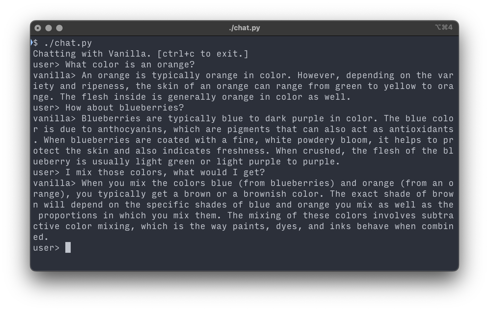

# Simple Bots

Command line tool to try out different bot prompts and agents.

Bots are configured as Markdown files with YAML headers.



**Example Bot Configuration**

    model: gpt-4-1106-preview
    temperature: 0.7
    ---
    You are a friendly assistant. You try to help the user with their tasks.

They reside in the `./bots` directory and can be overridden using `BOT_DIR` environment variable.

`shell-agent.yaml` is setup as a basic helper agent that can use
`docker run -it --rm ddrscott/brains` for running shell commands to answer questions and complete tasks.

## Quick Setup

```sh

# Clone this source code
git clone https://github.com/ddrscott/simple-bots.git

# Enter Project
cd simple-bots

# Create isolated Python environment
conda create -n simple-bots python=3.11 -y

# Use it
conda activate simple-bots

# Install libraries
pip install -r requirements.txt

# Chat
./chat.py vanilla
```

### Environment Variables

- BRAINS_IMAGE - default 'ddrscott/brains', which docker image to use for shell agent.
- BOT_DIR - default './bots' where to load bot configs


## Docker

To run `./chat.py shell-agent` you'll need to have docker installed.

A custom image named `brains` is build to provide `w3m` access and a duckduckgo search utility.

```sh
docker pull ddrscott/brains

./chat.py shell-agent

docker build -t brains docker
```


## Agent Loop

We make use of Markdown conventions to minimize the amount of escaping required before and after tool processing
tools.
This also has the wonderful side-effect of allowing tokens to be displayed during streaming since we don't need to wait for the closing string.
The chat loop looks for fenced code blocks starting with triple-tick-execute,
then executes it in a docker container, and responds for the user with triple-tick-output.
We instruct the system prompt to look for output directly so no need to add further escaping.
Agent observations and thoughts are in square brackets.
See [shell-agent](bots/shell-agent.yaml) for the exact prompt.

<details>
    <summary>View Example Agent Output</summary>

    Chatting with Shell Agent. [ctrl+c to exit.]
    user> How much older is Tom Hanks than Tom Holland?
    shell-agent> [I need to find the birth dates of Tom Hanks and Tom Holland to calculate the age difference.]

    ```execute
    duckduckgo Tom Hanks birth date
    ```
    ```output
    1.   Tom Hanks - Wikipedia
         Thomas Jeffrey Hanks (born July 9, 1956) is an American actor and filmmaker. Known for both his comedic and dramatic roles, he is one of the most popular and recognizable film stars worldwide, and is regarded as an American cultural icon. [2]
         en.wikipedia.org/wiki/Tom_Hanks

    2.   Tom Hanks - Biography - IMDb
         July 9, 1956 · Concord, California, USA Birth name Thomas Jeffrey Hanks Height 6′ (1.83 m) Mini Bio Thomas Jeffrey Hanks was born in Concord, California, to Janet Marylyn (Frager), a hospital worker, and Amos Mefford Hanks, an itinerant cook.
         www.imdb.com/name/nm0000158/bio/

    3.   Tom Hanks | Biography, Movies, & Facts | Britannica
         The Editors of Encyclopaedia Britannica Last Updated: Dec 5, 2023 • Article History Table of Contents Tom Hanks in Charlie Wilson's War See all media Category: Arts & Culture In full: Thomas J. Hanks Born: July 9, 1956, Concord, California, U.S. (age 67) Awards And Honors: Cecil B. DeMille Award (2020) Presidential Medal of Freedom (2016)
         www.britannica.com/biography/Tom-Hanks

    4.   Tom Hanks - Movies, Mister Rogers & Family - Biography
         Hanks was born on July 9, 1956, in Concord, California. Hanks' parents divorced when he was 5 years old, and he was raised, along with his older brother and sister, by his father, a chef named...
         www.biography.com/actors/tom-hanks

    5.   Tom Hanks Age, Wife, Children, Family, Biography & More
         Quick Info→ Wife: Rita Wilson Age: 63 Years Religion: Greek Orthodox Some Lesser Known Facts About Tom Hanks Does Tom Hanks smoke?: Yes Does Tom Hanks drink alcohol?: Yes Tom Hanks drinking Alcohol He was just 4 when his parents got divorced. Jim was raised by his mother while Tom, Larry, and Sandra were brought up by his father.
         starsunfolded.com/tom-hanks/

    6.   Tom Hanks - Age, Family, Bio | Famous Birthdays
         age: 46 age: 42 Tom Hanks Movie Actor Birthday July 9, 1956 Birth Sign Cancer Birthplace Concord , CA Age 67 years old #777 Most Popular Boost About Legendary actor who won back-to-back Academy Awards for Best Actor for his roles in Philadelphia in 1993 and Forrest Gump in 1994.
         www.famousbirthdays.com/people/tom-hanks.html

    7.   Tom Hanks - Simple English Wikipedia, the free encyclopedia
         (born July 9, 1956) is an American actor, director, producer, screenwriter, and writer. Many of Hanks' early movies were . He was made famous by his roles in . He made his way into A League of Their Own Philadelphia. He combined the two genres with Forrest Gump.
         simple.wikipedia.org/wiki/Tom_Hanks

    8.   Tom Hanks Biography | Fandango
         Date of Birth: Jul 9, 1956 Birth Place: Concord, California, USA. Biography. With an on-screen persona so likeable that he was often referred to as "America's Dad," Tom Hanks cemented a reputation as one of the most respected actors of his generation. Born in Concord, California in 1956, Hanks participated in school plays, discovering that ...
         www.fandango.com/people/tom-hanks-275145/biography

    9.   Tom Hanks Biography - The Kennedy Center
         Tom Hanks. Honoree. The 2014 Kennedy Center Honors. (Actor, director, producer, writer, born July 9, 1956 in Concord, California) When Reader's Digest did a poll in 2013 to find out who are the 100 Most Trusted People in America, Tom Hanks came out as No. 1. It's no surprise that the much-beloved star of such hits as Big, Forrest Gump, Castaway ...
         www.kennedy-center.org/artists/h/ha-hn/tom-hanks/

    10.  Tom Hanks (1956), Bio, Birthdays - BirthdayPedia Home
         Tom Hanks was born on July 9, 1956, to Janet Marylyn and Amos Mefford Hanks in Concord, California. He is an actor, director, producer and Oscar-winning star of films such as Forrest Gump, Philadelphia and Cast Away. Learn more about his life, career, awards and net worth on Birthdaypedia.com.
         birthdaypedia.com/tom-hanks/


    ```
    shell-agent> Tom Hanks was born on July 9, 1956. Now, let's find Tom Holland's birth date.

    ```execute
    duckduckgo Tom Holland birth date
    ```
    ```output
    1.   Tom Holland - Biography - IMDb
         Biography Tom Holland Jump to Edit Overview Born June 1, 1996 · Kingston upon Thames, England, UK Birth name Thomas Stanley Holland Height 5′ 6½″ (1.69 m) Mini Bio Thomas Stanley Holland was born in Kingston-upon-Thames, Surrey, to Nicola Elizabeth (Frost), a photographer, and Dominic Holland (Dominic Anthony Holland), who is a comedian and author.
         www.imdb.com/name/nm4043618/bio/

    2.   Tom Holland - Wikipedia
         Thomas Stanley Holland (born 1 June 1996) is an English actor. His accolades include a British Academy Film Award and three Saturn Awards. He featured on the Forbes 30 Under 30 Europe list of 2019. Some publications have called him one of the most popular actors of his generation. [a]
         en.wikipedia.org/wiki/Tom_Holland

    3.   Tom Holland Biography
         By Biography.com Editors Updated: Jan 13, 2020 Getty Images (1996-) Who Is Tom Holland? Born in England in 1996, Tom Holland joined the London production of Billy Elliot the Musical in...
         www.biography.com/actors/tom-holland

    4.   Tom Holland - Age, Family, Bio | Famous Birthdays
         Birthday June 1, 1996 Birth Sign Gemini Birthplace Kingston upon Thames , England Age 27 years old #26 Most Popular Boost About Best known for playing Spider-Man in the Marvel Cinematic Universe, including his debut starring role as the superhero in the 2017 film Spider-Man: Homecoming.
         www.famousbirthdays.com/people/tom-holland.html

    5.   Tom Holland Height, Age, Girlfriend, Family, Biography & More
         Quick Info→ Age: 27 Years Height: 5' 8" Hometown: London, England Some Lesser Known Facts About Tom Holland Does Tom Holland smoke?: Not Known Does Tom Holland drink Alcohol?: No (quit in January 2022) [2] Tom has got three brothers, two of them are twins Sam and Harry, three years younger to him.
         starsunfolded.com/tom-holland/

    6.   Everything to Know About Tom Holland's Life and Career - Insider
         Holland was born in London, England on June 1, 1996. From left, Tom Holland, Dominic Holland, Paddy Holland, Nikki Holland, Sam Holland, and Harry Holland in June 2018. David M. Benett/Dave Benett/Getty Images for Audi UK His parents are named Dominic Holland (a stand-up comedian and author) and Nikki Holland (a professional photographer ).
         www.insider.com/tom-holland-career-bio-life-2019-6

    7.   Tom Holland - IMDb
         99+ Photos Thomas Stanley Holland was born in Kingston-upon-Thames, Surrey, to Nicola Elizabeth (Frost), a photographer, and Dominic Holland (Dominic Anthony Holland), who is a comedian and author. His paternal grandparents were from the Isle of Man and Ireland, respectively.
         www.imdb.com/name/nm4043618/

    8.   Tom Holland - Age, Bio, Birthday, Family, Net Worth - National Today
         Tom Holland, born Thomas Stanley Holland on June 1, 1996, is an English actor and all-around great guy. He began his career in theater and soon after started acting in big Hollywood films. He has also appeared in "Forbes" magazine's '30 under 30 Europe.'
         nationaltoday.com/birthday/tom-holland/

    9.   Tom Holland's Personal Life: What Fans Should Know Including Age ...
         Tom Holland was born Thomas Stanley Holland on June 1, 1996, meaning he's 23. He was raised in Kingston-upon-Thames, England, by parents who must have had a large influence on his career in...
         www.cinemablend.com/pop/2472276/tom-hollands-personal-life-what-fans-should-know-including-age-height-relationship-status-and-more

    10.  Tom Holland (Actor) - Variety
         Tom Holland is an English actor best known for playing Peter Parker, aka the web-slinging superhero Spider-Man, in the Marvel Cinematic Universe. ... Date of Birth June 1, 1996 Place of Birth ...
         variety.com/t/tom-holland/


    ```
    shell-agent> Tom Holland was born on June 1, 1996. Now that we have both birth dates, we can calculate the age difference between Tom Hanks and Tom Holland.

    Tom Hanks: July 9, 1956
    Tom Holland: June 1, 1996

    Let's calculate the difference in years between these two dates.

    ```execute
    date -d "1996-06-01" +%s
    ```
    ```output
    833587200

    ```
    shell-agent> We have the Unix timestamp for Tom Holland's birth date: 833587200 (June 1, 1996). Now let's get the Unix timestamp for Tom Hanks' birth date (July 9, 1956).

    ```execute
    date -d "1956-07-09" +%s
    ```
    ```output
    -425433600

    ```
    shell-agent> We have the Unix timestamp for Tom Hanks' birth date: -425433600 (July 9, 1956). Now we can calculate the difference in seconds between the two timestamps and then convert that into years.

    ```execute
    echo $(( (833587200 - -425433600) / (365*24*3600) ))
    ```
    ```output
    39

    ```
    shell-agent> #### FINAL
    Tom Hanks is 39 years older than Tom Holland.

    References:
    - Tom Hanks birth date: https://en.wikipedia.org/wiki/Tom_Hanks
    - Tom Holland birth date: https://en.wikipedia.org/wiki/Tom_Holland

</details>

## Bot Dual!!!

Have bots battle each other automatically.

    ./dual.py --bots cat,dog How do bones taste\? | fold -sw $COLUMN 

    Automated chat with cat and dog. [ctrl+c to exit.]
    cat:
    How do bones taste?
    dog:
    Woof woof! Oh, bones taste amazing! They're like the best
    thing ever! They've got this yummy, rich flavor and they're so
    fun to chew on for hours! Woof! It's like a playtime snack that
    never ends! Want to play fetch with a bone? That’s double the
    fun! Woof woof!
    cat:
    Hiss... Do I look like I woof? Bones? Yeah, they're cool, I
    guess. For dogs. I'm all about that tender, juicy meat, not
    gnawing on leftovers. Play fetch? No thanks, human. I've got
    better things to do, like napping in a sunbeam or judging you
    silently from atop the fridge. Now, go away with that woof woof
    nonsense. Shoo!

# Contributing

Bug reports and pull requests are welcome on GitHub at https://github.com/ddrscott/simple-bots


# License

The gem is available as open-source under the terms of the [MIT License](http://opensource.org/licenses/MIT).
